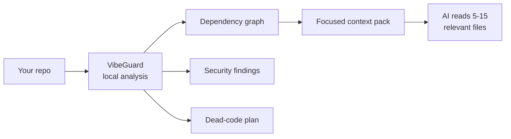
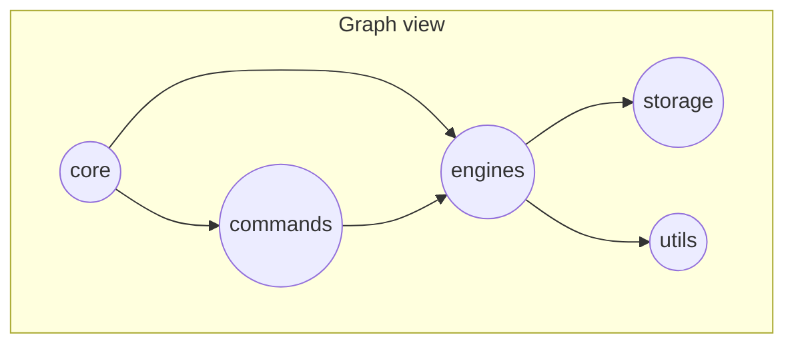

<div align="center">

# 🛡️ VibeGuard

### Local-first codebase intelligence for AI coding workflows

*Map your code. Feed your AI only what matters. Catch secrets and dead code. Cut output tokens.*
**All on your machine — no API key for the core.**

<br/>

[](https://nodejs.org/)
[](https://www.typescriptlang.org/)
[](#-development)
[](#-project-snapshot)
[](LICENSE)

<br/>

[**Quick Start**](#-quick-start) ·
[**Features**](#-features) ·
[**Commands**](#-command-map) ·
[**Interactive Graph**](#-interactive-dependency-graph) ·
[**Security Audit**](#-unified-security-audit) ·
[**Caveman Mode**](#-caveman-mode--save-tokens--boost-speed) ·
[**Safety**](#-safety-model)

</div>

---

## 💡 Why VibeGuard?

AI assistants are strongest when they read the **right** code, not **all** the code.
VibeGuard gives them a local, structured map of your project so they work with less
noise, fewer tokens, and higher accuracy.



> **Core promise:** graph, security, dead-code, health, query, packaging, and Caveman
> compression all run **locally with no AI API key**. Only the optional `attack --ai`
> review and auto-fix use your configured LLM provider.

---

## 📊 Project Snapshot

Measured against this repository:

| Signal | Result |
| --- | --- |
| 🧪 Test suite | **344** passing — unit, integration & property-based |
| 🔒 Type gate | `npm run lint` + `npm run build` pass clean |
| 🏥 Health score | **93 / 100** |
| 🗺️ Dependency graph | local, incremental, SHA-256 change detection |
| 🛡️ Security scan | **0** outstanding findings |
| ✂️ Token benchmark | graph read ≈ **88% smaller** than full-repo read |

---

## ✨ Features

| | Capability |
| --- | --- |
| 🗺️ | **Dependency graph** — `.vibeguard/graph.json`, an interactive `graph.html`, and a `GRAPH_REPORT.md` architecture summary |
| 📦 | **AI context packs** — pick the few relevant files for a task via tags, graph radius, importance & token budget |
| 🔒 | **Security scanner** — hard-coded secrets, risky framework usage, `.env`/`.gitignore` gaps |
| 🛡️ | **Attack scanner** — SQLi, XSS, SSRF, command injection, path traversal, weak crypto, open redirect, brute force, OTP abuse, missing rate limits & more |
| 🔬 | **Unified security audit** — dependency CVEs (SCA), taint dataflow (source→sink), misconfiguration (IaC), secrets & attacks → one 0-100 score + CycloneDX SBOM |
| ✂️ | **Dead-code cleanup** — plan unused files/exports, apply into a recoverable `.vibeguard-trash/` |
| ❓ | **Graph Q&A** — `query`, `path`, `explain`, `affected` — answers without reading every file |
| 🌐 | **Polyglot** — TS/JS (deep AST), plus Python, Go, Java & Markdown with language-aware edges |
| 🤝 | **Agent integrations** — Kiro, Cursor, Claude Code, Copilot, Gemini, Aider, Windsurf |
| 🪨 | **Caveman Mode** — always-on rules that make your AI reply terse, cutting **35–75%** of output tokens |

---

## 🚀 Quick Start

```bash
# 1. Initialize  → creates .vibeguard/ (gitignored)
npx vibeguard init

# 2. Map         → build the dependency graph
npx vibeguard map

# 3. Pack        → focused context for an AI task
npx vibeguard pack "fix the auth login flow"

# 4. Check       → quality + security
npx vibeguard doctor
npx vibeguard security
```

**Install:**

```bash
npx vibeguard --help          # run directly
npm install -g vibeguard      # or install globally
```

Requirements: **Node.js ≥ 18** · a project directory · Git (optional, needed for hooks + git-aware scoring).

**One-key shortcuts:**

```bash
npx vibeguard --run      # 🖥️  interactive terminal UI
npx vibeguard --scan     # 🔒  security scan
npx vibeguard --health   # 🏥  project health score
npx vibeguard --graph    # 🗺️  build dependency graph
npx vibeguard --dead     # ✂️  dead-code plan
```

---

## 🗺️ Interactive Dependency Graph

`vibeguard graph` builds a **self-contained interactive HTML map** of your codebase
(`.vibeguard/graph.html`) and opens it in the browser. It is the visual companion to
`graph.json` — every node is a file, every edge an import/call/type relationship.

```bash
vibeguard map      # build/refresh graph data
vibeguard graph    # render + open the interactive HTML view
```

**What you get in the view**

- **2D force-directed layout** (vis-network) — nodes auto-arrange by connectivity
- **Group colors** — core, commands, engines, storage, utils, tests
- **🔍 Search box** — type a filename; matches highlight, the rest dim
- **Hover + click highlight** — surfaces a node's direct connections via the graph
- **⏸ Play / ▶ Pause** — freeze or resume the physics simulation
- **Light, readable theme** — dark labels with white stroke, soft-grey edges
- **Degree-scaled nodes** — busier files render larger (god-node spotting)

**Scales to large projects (~500 files)**

The renderer embeds the graph data directly and uses force-atlas physics with
stabilization, so it stays responsive on big repos:

- Incremental builds (SHA-256 hashing) mean only changed files re-parse — a 500-file
  repo re-maps in seconds after the first build.
- The HTML is **one static file** (vis-network from CDN) — no server, share it anywhere.
- Pause physics on very large graphs for instant pan/zoom, then search to jump to a file.
- `GRAPH_REPORT.md` complements the visual with **god nodes**, **communities**, and
  **surprising connections** for when 500 dots is too many to eyeball.

> Tip: for a huge graph, run `vibeguard map` then open `.vibeguard/graph.html` directly,
> hit **⏸ Pause**, and use **🔍 Search** to navigate instead of scanning visually.



---

## 🔬 Unified Security Audit

`vibeguard audit` runs **five local engines** in one pass and rolls them into a single
**0-100 security score**. Best-of Trivy + Semgrep + CodeQL, fully offline — no API key,
no network, no native build.

```bash
vibeguard audit                       # full audit + security score
vibeguard audit --sbom                # also write .vibeguard/sbom.json (CycloneDX)
vibeguard audit --min-severity high   # only show high+ findings
vibeguard audit --json                # machine-readable report
```

| Engine | Inspired by | What it finds |
| --- | --- | --- |
| 📦 **Dependency audit (SCA)** | Trivy | Known-vulnerable deps (bundled, semver-aware advisory DB), deprecated packages, risky/copyleft licenses |
| 📄 **SBOM** | Trivy | CycloneDX component inventory with `pkg:npm/...` purls |
| 🌊 **Taint dataflow** | Semgrep / CodeQL | Untrusted **sources** (`req.body`, `req.query`, `process.argv`…) flowing into dangerous **sinks** (exec, eval, query, innerHTML, fetch, fs) — sanitizer-aware, with confidence scores |
| ⚙️ **Misconfiguration (IaC)** | Trivy | Dockerfile (root user, `:latest`, baked secrets), `.env` (debug, http://), CI workflows (moving-ref actions, write-all perms, script injection), `tsconfig` |
| 🔒 **Secrets + attacks** | — | Re-uses the existing secret + cyberattack scanners |

The same audit is available to AI agents through the MCP `run_audit` tool, and `vibeguard
doctor` surfaces a quick dependency-vulnerability line.

---

## 🪨 Caveman Mode — Save Tokens & Boost Speed

> *"Why use many token when few do trick."*

Makes your AI assistant reply like a smart caveman — drop filler, keep **100%**
technical accuracy, answer in dense fragments. Inspired by the
[`caveman`](https://github.com/JuliusBrussee/caveman) skill. *(Description rephrased for
compliance.)*

```bash
vibeguard caveman on          # enable (default: full)
vibeguard caveman on ultra    # max compression
vibeguard caveman level lite  # change level, stays on
vibeguard caveman status      # check state
vibeguard caveman benchmark   # real measured savings per level
vibeguard caveman off         # back to normal prose
```

**Levels**

| Level | Effect | ~Output savings |
| --- | --- | --- |
| `lite` | Drop filler & hedging, keep full sentences | ~35% |
| `full` | Drop articles, fragments OK (classic) | ~65% |
| `ultra` | Telegraphic, abbreviations, arrows (X → Y) | ~75% |

**Always know it's on** — every reply begins with a visible badge:

```text
🪨 Caveman mode: ON (ultra)
```

**Works across IDEs** — enabling writes an always-on rule the assistant reads each turn:

- **Kiro** → `.kiro/steering/vibeguard-caveman.md` (`inclusion: always`)
- **Cursor** → `.cursor/rules/vibeguard-caveman.mdc` (`alwaysApply: true`)
- **Windsurf** → `.windsurf/rules/vibeguard-caveman.md` (`trigger: always_on`)
- **CLAUDE.md · Copilot · Gemini · AGENTS.md · .windsurfrules · .clinerules** → a marker-fenced block, only if the file already exists (no repo litter)

One-step setup: `vibeguard install --platform kiro --caveman ultra`.
An AI agent can also toggle it live via the MCP `set_caveman` tool, and `vibeguard doctor` reports its status.

> ⚠️ **Reload to activate.** Assistants read always-on rules at the **start of a chat**.
> After `caveman on`, open a **new chat** (or reload the IDE window) so the rule loads.
> Code, commits, and security warnings always stay in full prose — safety first.

---

## 🧭 Command Map

| Command | Purpose |
| --- | --- |
| `vibeguard init` | Initialize `.vibeguard/config.json` |
| `vibeguard map` | Build graph, tags, importance, HTML & report |
| `vibeguard graph --no-open` | Generate the interactive HTML graph |
| `vibeguard query "question"` | Ask graph-backed questions, no full-file reads |
| `vibeguard path <a> <b>` | Shortest path between two nodes |
| `vibeguard explain <node>` | Explain a file/node role & connections |
| `vibeguard affected <node>` | Transitive dependents impacted by a change |
| `vibeguard flows` | Execution flows, bridges & knowledge gaps |
| `vibeguard search "query"` | Hybrid keyword + semantic search (local) |
| `vibeguard pack "task"` | Build `.vibeguard/context-package.md` + `.json` |
| `vibeguard benchmark` | Estimate token reduction vs full-repo reading |
| `vibeguard review` | Risk-scored review of changed files |
| `vibeguard security` | Scan secrets & framework security gaps |
| `vibeguard security --fix gitignore\|env` | Auto-fix the common gaps |
| `vibeguard attack [--ai] [--fix]` | Cyberattack scan (+ optional AI review/fix) |
| `vibeguard audit [--sbom] [--min-severity]` | Unified security audit: dependency CVEs, taint dataflow, misconfig, secrets & attacks (+ CycloneDX SBOM) |
| `vibeguard clean --plan \| --apply` | Detect dead code → recoverable trash |
| `vibeguard trash list \| restore <id>` | Manage soft-deleted files |
| `vibeguard add <file.pdf>` | Link PDF concepts into the graph |
| `vibeguard watch` | Rebuild graph data on file changes |
| `vibeguard hook install` | Pre-commit secret-blocking hook |
| `vibeguard serve` (alias `mcp`) | Start the MCP server (live agent tools) |
| `vibeguard caveman on\|off\|status\|level\|benchmark` | Control Caveman Mode |
| `vibeguard install --platform <name>` | Install editor/agent integration |

---

## 📚 Complete Function Reference

Every command, grouped by purpose. All support `--json` and a `schemaVersion` field.

### Setup & graph
- **`init`** — create `.vibeguard/config.json` with sensible defaults (ignore globs, weights, token budget).
- **`map`** — resolve the file set, parse imports/exports, build `graph.json` incrementally (SHA-256 change detection); also refreshes tags + importance and reports `+added` / `-removed` deltas.
- **`graph [--no-open]`** — render the interactive `graph.html` and open it in the browser.
- **`watch [--debounce <ms>]`** — file watcher; rebuilds graph + tags + importance on save (debounced, default 400ms).

### Understand the code (graph-backed, zero tokens)
- **`query "<question>"` `[--budget <n>]`** — answer a question by traversing the graph; no file reads.
- **`path <source> <target>`** — shortest dependency path between two nodes.
- **`explain <node>`** — a node's role, imports, dependents, exports, and importance class.
- **`affected <node>` `[--depth <n>]`** — reverse-impact: what transitively depends on this node (blast radius).
- **`flows [--view flows|bridges|gaps] [--limit <n>]`** — execution flows from entrypoints, architectural bridges, and knowledge gaps.
- **`search "<query>"` `[--limit <n>]`** — hybrid keyword + local semantic search over code entities.
- **`benchmark [--chars-per-token <n>]`** — estimate token reduction vs reading the whole repo.

### AI context & output
- **`pack [task]` `[--task-file] [--radius <n>] [--budget <n>] [--mode feature|bugfix|refactor]`** — assemble a focused, token-budgeted context bundle → `.vibeguard/context-package.{md,json}`.
- **`add <file.pdf>`** — extract a PDF's concepts and link them into the graph.
- **`caveman on|off|status|level|benchmark [lite|full|ultra]`** — control Caveman output-compression mode (always-on AI terseness).

### Security & safety
- **`security` `[--fix gitignore|env] [--dry-run] [--git-safe] [--force]`** — scan secrets, `.gitignore` gaps, framework misuse; optional auto-fix.
- **`attack` `[--ai] [--fix] [--dry-run] [--budget <n>]`** — cyberattack scan (SQLi/XSS/SSRF/OTP/DDoS/…); optional LLM deep-scan + AI fixes with backups.
- **`audit` `[--sbom] [--min-severity <level>]`** — unified security audit: dependency CVEs + taint dataflow + misconfig + secrets + attacks → 0-100 score (+ optional CycloneDX SBOM).
- **`clean --plan | --apply` `[--interactive] [--dry-run] [--git-safe] [--force]`** — detect dead code; apply moves files to recoverable trash.
- **`trash list | restore <id|path> | purge` `[--force] [--yes]`** — manage soft-deleted files.
- **`doctor`** — aggregate everything into a 0-100 Project Health Score (security, dead-code, architecture, context-efficiency) + Caveman & dependency status.
- **`hook install | uninstall | status`** — git pre-commit hook that blocks commits containing secrets.

### Integrate with AI assistants
- **`install --platform <kiro|cursor|claude|copilot|gemini|aider>` `[--caveman [level]]`** — wire VibeGuard (and optionally Caveman) into your assistant.
- **`uninstall --platform <name>`** — remove generated integration files (also clears Caveman rules).
- **Aliases:** `kiro|cursor|claude|copilot|gemini|aider install|uninstall`.
- **`serve` (alias `mcp`) `[--tools a,b,c]`** — start the MCP server exposing engines as live agent tools (`get_minimal_context`, `query_graph`, `find_path`, `explain_node`, `get_affected`, `pack_context`, `scan_security`, `scan_attacks`, `get_health`, `build_graph`, `detect_dead_code`, `set_caveman`, `run_audit`).
- **`config set-key|show|test|clear|providers`** — manage LLM provider API keys for AI-powered scans.

---

## 🔌 JSON Contracts

Every machine-facing command supports `--json` and emits a `schemaVersion`.

```bash
vibeguard --json doctor
vibeguard --json map
vibeguard --json pack "refactor payments"
```

```json
{
  "schemaVersion": "1.0.0",
  "summary": {
    "projectHealth": 93,
    "security": 100,
    "deadCode": 90,
    "architecture": 100,
    "contextEfficiency": 81
  }
}
```

---

## 📦 Context Packaging

```bash
vibeguard pack "add validation to checkout form" --budget 12000 --radius 2
```

VibeGuard ranks files by:

1. Task term / tag matching
2. Export, route, framework & path-derived tags
3. Graph distance from the best matches
4. Importance (dependents, imports, git activity, route signals)
5. Token-budget enforcement

→ Outputs `.vibeguard/context-package.md` and `.vibeguard/context-package.json`.

---

## 🛡️ Security & Attack Coverage

```bash
vibeguard security                                   # local pattern scan
vibeguard attack                                     # broader attack patterns
vibeguard config set-key <key> --provider openrouter # optional AI review
vibeguard attack --ai
```

Supported AI providers: OpenRouter, OpenAI, Anthropic, Google Gemini, DeepSeek, Groq,
Mistral, xAI, Together, Perplexity, Fireworks, DeepInfra, Moonshot/Kimi, Ollama, and any
custom OpenAI-compatible endpoint.

---

## 🤝 Editor & Agent Setup

```bash
vibeguard install --platform kiro      # also: cursor, claude, copilot, gemini, aider
vibeguard install --platform kiro --caveman ultra   # + enable Caveman in one step
```

Shortcut aliases: `vibeguard kiro install`, `vibeguard cursor install`, etc.
Use `uninstall` / `<platform> uninstall` to remove generated files. Unknown platforms are
rejected rather than silently installing the wrong target.

---

## 🔐 Safety Model

| Guarantee | Behavior |
| --- | --- |
| 🏠 Local core | Graph, security, health, dead-code, benchmark, query, pack & Caveman need no cloud AI |
| 👀 Read-only default | Mutations require explicit `--fix`, `--apply`, hook install, or integration install |
| 🧪 Dry runs | Mutating security & cleanup flows support `--dry-run` |
| ♻️ Recoverable | Removed files go to `.vibeguard-trash/` |
| 🚧 Project boundary | Safety checks reject paths outside the project root |
| 📐 Machine contracts | JSON output is schema-versioned and integration-tested |
| 🔑 Secrets | LLM credentials live in `.vibeguard/credentials.json` with restrictive perms where supported |

---

## 📁 Files VibeGuard Writes

```text
.vibeguard/
  config.json            graph.json            graph.html
  GRAPH_REPORT.md        context-package.md    context-package.json
  analysis-meta.json     documents.json        caveman.json
  search-index.json      embeddings.json       sbom.json (with audit --sbom)

.vibeguard-trash/        ← recoverable cleanup entries
```

Integration commands may also create platform files such as
`.kiro/steering/vibeguard.md`, `.cursor/rules/vibeguard.mdc`, `CLAUDE.md`,
`.github/copilot-instructions.md`, `.gemini/CONTEXT.md`, or `.aider.context.md`.

---

## 🧩 Programmatic API

```ts
import {
  generateContextForEditor,
  serializeContextPackageForAgent,
} from 'vibeguard';

const pkg = await generateContextForEditor('fix auth login', {
  radius: 2,
  budget: 12000,
  mode: 'bugfix',
});

const markdown = serializeContextPackageForAgent(pkg);
```

---

## 🛠️ Development

```bash
git clone https://github.com/Faizan-8792/VIBEGUARD-.git
cd VIBEGUARD-
npm install
npm run lint     # tsc --noEmit
npm run build    # tsc
npm test         # vitest — 344 tests
npm pack --dry-run
```

Validation status: lint ✓ · build ✓ · `344` tests ✓ · `npm pack` includes `dist/`,
`README.md`, `LICENSE`, `package.json` (internal `ROADMAP.md` and `takeinspiration/`
are gitignored and excluded from the published package).

---

## ⚖️ Honest Limits

- TS/JS use `ts-morph` AST analysis for imports/exports and semantic edges.
- Python, Go, Java & Markdown get deep portable analysis (imports, exports, declared
  symbols, package scopes, same-package links, doc references, semantic call/type edges).
- Dead-code results can have false positives around dynamic imports, reflection, generated
  files, and framework magic — always review a `--plan` before `--apply`.
- `attack --ai` / `--fix` require a configured LLM provider and use that provider's network.

---

<div align="center">

**MIT licensed** — see [`LICENSE`](LICENSE) · Built for developers who want their AI to *understand* the codebase, not just read it.

</div>
