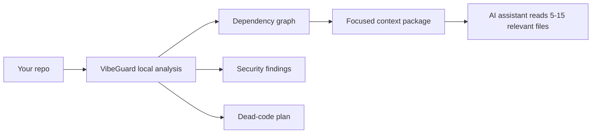

# VibeGuard

<p align="center">
  <strong>Local-first codebase intelligence for AI coding workflows.</strong><br/>
  Build dependency graphs, generate focused AI context, scan security risks, find dead code, and wire the results into your editor or agent.
</p>

<p align="center">
  =18" src="https://img.shields.io/badge/node-%3E%3D18-22c55e?style=for-the-badge" />
  
  
  
  
</p>

---

## Why VibeGuard?

AI assistants are strongest when they read the right code, not all the code. VibeGuard gives them a local, structured map of your project so they can work with less noise and fewer tokens.



**Core promise:** the main graph, security, dead-code, health, query, and packaging workflows run locally with no AI API key. Optional AI-powered attack review and auto-fix use your configured LLM provider.

## Project Snapshot

Measured against this repository:

| Signal | Result |
| --- | --- |
| Test suite | `215` passing tests across unit, integration, and property-based coverage |
| Type gate | `npm run lint` and `npm run build` pass |
| Health score | `93/100` |
| Dependency graph | `59` nodes, `227` edges |
| Security scan | `0` critical/high/medium/low/info findings |
| Token benchmark | Graph read estimate is `80.9%` smaller than full repo read |

## Features

- **Dependency graph:** builds `.vibeguard/graph.json`, `.vibeguard/graph.html`, and `.vibeguard/GRAPH_REPORT.md`.
- **AI context packs:** selects relevant files for a task using tags, graph radius, importance, and token budget.
- **Security scanner:** detects hard-coded secrets, risky framework usage, `.env`/`.gitignore` gaps, and common vulnerability patterns.
- **Attack scanner:** checks SQLi, XSS, SSRF, command injection, path traversal, weak crypto, open redirect, brute force, OTP abuse, DDoS-style missing rate limits, and more.
- **Dead-code cleanup:** plans unused file/export cleanup and moves applied removals into `.vibeguard-trash/` for recovery.
- **Graph Q&A:** answers graph-backed questions, shortest paths, node explanations, and affected-node impact analysis.
- **Polyglot coverage:** deep TypeScript/JavaScript analysis plus lightweight Python, Go, Java, Markdown, and PDF concept support.
- **Agent integrations:** installs guidance for Kiro, Cursor, Claude Code, GitHub Copilot, Gemini, and Aider.

## Install

```bash
# Run directly
npx vibeguard --help

# Or install globally
npm install -g vibeguard
vibeguard --help
```

Requirements:

- Node.js `>=18`
- A local project directory
- Git is optional, but required for hook installation and git-aware scoring

## Quick Start

```bash
# 1. Create .vibeguard/config.json
npx vibeguard init

# 2. Build the project graph
npx vibeguard map

# 3. Generate focused context for an AI task
npx vibeguard pack "fix the auth login flow"

# 4. Check quality and security
npx vibeguard doctor
npx vibeguard security
```

Shortcut mode:

```bash
npx vibeguard --run      # Interactive terminal UI
npx vibeguard --scan     # Security scan
npx vibeguard --health   # Project health score
npx vibeguard --graph    # Build dependency graph
npx vibeguard --dead     # Dead-code plan
```

## Command Map

| Command | Purpose |
| --- | --- |
| `vibeguard init` | Initialize `.vibeguard/config.json` |
| `vibeguard map` | Build graph, tags, importance, HTML, and report outputs |
| `vibeguard graph --no-open` | Generate interactive HTML dependency graph |
| `vibeguard query "question"` | Ask graph-backed questions without reading every file |
| `vibeguard path <source> <target>` | Find shortest path between graph nodes |
| `vibeguard explain <node>` | Explain a file/node role and connections |
| `vibeguard affected <node>` | Show transitive dependents impacted by a change |
| `vibeguard pack "task"` | Create `.vibeguard/context-package.md` and `.json` |
| `vibeguard benchmark` | Estimate token reduction versus full-repo reading |
| `vibeguard security` | Scan secrets and framework security gaps |
| `vibeguard security --fix gitignore` | Add missing secret files to `.gitignore` |
| `vibeguard security --fix env` | Move detected secrets into `.env` |
| `vibeguard attack` | Scan broader cyberattack patterns |
| `vibeguard attack --ai` | Run optional LLM-assisted security review |
| `vibeguard attack --ai --fix` | Generate and apply AI fixes with backups |
| `vibeguard clean --plan` | Detect dead-code cleanup candidates |
| `vibeguard clean --apply` | Move approved cleanup targets to trash |
| `vibeguard trash list` | List recoverable trash entries |
| `vibeguard trash restore <id\|path>` | Restore a soft-deleted file |
| `vibeguard add <file.pdf>` | Extract PDF concepts and link them to the graph |
| `vibeguard watch` | Rebuild graph data after file changes |
| `vibeguard hook install` | Install pre-commit security hook |
| `vibeguard hook graph-install` | Install post-commit graph rebuild hook |
| `vibeguard config providers` | List supported LLM providers |
| `vibeguard install --platform cursor` | Install editor/agent integration |

## JSON Contracts

Every machine-facing command supports `--json` and includes a `schemaVersion` field.

```bash
vibeguard --json doctor
vibeguard --json map
vibeguard --json pack "refactor payments"
```

Example:

```json
{
  "schemaVersion": "1.0.0",
  "summary": {
    "projectHealth": 93,
    "security": 100,
    "deadCode": 90,
    "architecture": 100,
    "contextEfficiency": 81
  }
}
```

## Context Packaging

```bash
vibeguard pack "add validation to checkout form" --budget 12000 --radius 2
```

VibeGuard ranks files using:

1. Task term/tag matching
2. Export, route, framework, and path-derived tags
3. Graph distance from the best matches
4. Importance scoring from dependents, imports, git activity, and route signals
5. Token budget enforcement

Outputs:

- `.vibeguard/context-package.md`
- `.vibeguard/context-package.json`

## Security and Attack Coverage

Run local pattern scans:

```bash
vibeguard security
vibeguard attack
```

Run optional AI-assisted review:

```bash
vibeguard config set-key <key> --provider openrouter
vibeguard attack --ai
```

Supported providers include OpenRouter, OpenAI, Anthropic, Google Gemini, DeepSeek, Groq, Mistral, xAI, Together, Perplexity, Fireworks, DeepInfra, Moonshot/Kimi, Ollama, and custom OpenAI-compatible endpoints.

## Editor and Agent Setup

```bash
vibeguard install --platform kiro
vibeguard install --platform cursor
vibeguard install --platform claude
vibeguard install --platform copilot
vibeguard install --platform gemini
vibeguard install --platform aider
```

Shortcut aliases:

```bash
vibeguard kiro install
vibeguard cursor install
vibeguard claude install
vibeguard copilot install
vibeguard gemini install
vibeguard aider install
```

Use `uninstall` or `<platform> uninstall` to remove generated integration files. Unknown platforms are rejected instead of silently installing the wrong target.

## Safety Model

| Guarantee | Behavior |
| --- | --- |
| Local core | Graphing, security, health, dead-code, benchmark, query, and pack do not require cloud AI |
| Read-only default | Mutations require explicit `--fix`, `--apply`, hook install, or integration install |
| Dry runs | Mutating security and cleanup flows support `--dry-run` |
| Recoverable cleanup | Removed files go to `.vibeguard-trash/` |
| Project boundary | Safety checks reject paths outside the project root |
| Machine contracts | JSON output is schema-versioned and covered by integration tests |
| Secrets handling | LLM credentials are stored in `.vibeguard/credentials.json` with restrictive permissions where supported |

## Files VibeGuard Writes

```text
.vibeguard/
  config.json
  graph.json
  graph.html
  GRAPH_REPORT.md
  context-package.md
  context-package.json
  analysis-meta.json
  documents.json

.vibeguard-trash/
  <recoverable cleanup entries>
```

Integration commands may also create platform-specific files such as `.cursor/rules/vibeguard.mdc`, `CLAUDE.md`, `.github/copilot-instructions.md`, `.gemini/CONTEXT.md`, or `.aider.context.md`.

## Programmatic API

```ts
import {
  generateContextForEditor,
  serializeContextPackageForAgent,
} from 'vibeguard';

const contextPackage = await generateContextForEditor('fix auth login', {
  radius: 2,
  budget: 12000,
  mode: 'bugfix',
});

const markdown = serializeContextPackageForAgent(contextPackage);
```

## Development

```bash
git clone https://github.com/Faizan-8792/VIBEGUARD-.git
cd VIBEGUARD-
npm install
npm run lint
npm run build
npm test
npm pack --dry-run
```

Current validation:

- `npm run lint` passes
- `npm run build` passes
- `npm test` passes with `215` tests
- `npm pack --dry-run` includes `dist/`, `README.md`, `ROADMAP.md`, `LICENSE`, and `package.json`

## Honest Limits

- TypeScript and JavaScript receive the deepest AST-based analysis.
- Python, Go, Java, and Markdown support is intentionally lightweight and pattern-based.
- Dead-code results can have false positives around dynamic imports, reflection, generated files, and framework magic.
- `attack --ai` and `attack --ai --fix` require a configured LLM provider and may use network access through that provider.

## License

MIT — see `LICENSE`.

